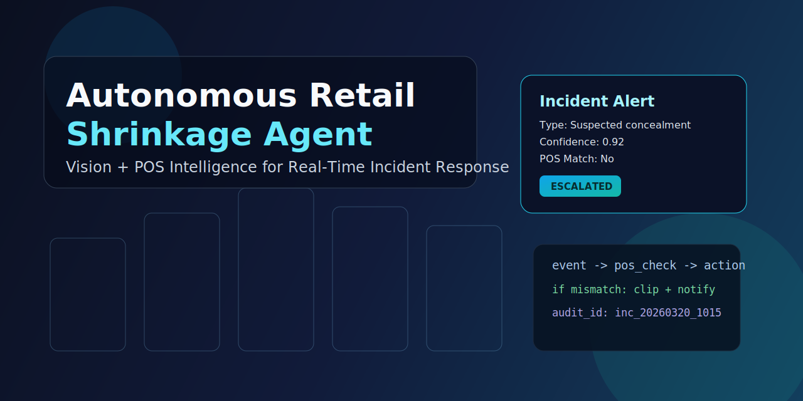
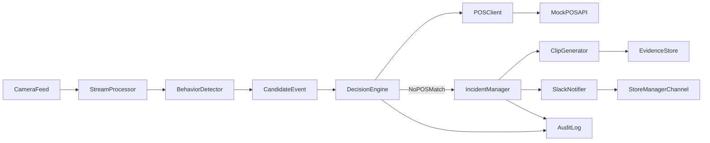

# Autonomous Retail Loss Prevention Intelligence Platform

> Agentic retail intelligence platform that combines behavioral sequence analysis, zone-aware trajectory modeling, POS validation, and explainable reasoning chains for incident decisions.

<p align="center">
  
</p>


## Project description

An end-to-end AI loss-prevention system that goes beyond object disappearance rules. It models suspicious intent using multi-stage behavior patterns, spatial movement through store zones, and transaction validation before escalation.

## What makes this unique

Most portfolio projects stop at "object missing => alert". This platform implements three core intelligence layers:

- **Behavioral sequence engine:** tracks micro-behaviors (`lingering`, `pickup`, `look-around`, `conceal`, `move-to-exit`) and matches known theft signatures.
- **Zone intelligence engine:** classifies person trajectories across store layout zones and estimates checkout-vs-exit intent.
- **Explainable reasoning engine:** generates a step-by-step decision chain (`observation -> behavior -> zone -> POS -> confidence -> verdict`) for audit-ready transparency.

This design produces richer, lower-noise incident decisions and gives operations teams explainable evidence instead of black-box alerts.

## System architecture



## What the agent does

1. Watches webcam/video stream for suspicious concealment behavior.
2. Creates a candidate event with timestamp and confidence.
3. Queries POS scans in a configurable time window.
4. Flags mismatch between observed item behavior and scanned inventory.
5. Generates an incident-centered 5-second clip.
6. Sends a structured Slack alert with evidence and reason code.

## Visual dashboard

Open `http://localhost:8080/` to access a polished operations dashboard with:
- Live camera/simulated feed with detection HUD
- Incident metrics and real-time event stream
- Explainable reasoning chain panel (latest verdict with steps)
- Behavioral timeline (micro-behavior chips)
- Zone map + trajectory verdict + checkout/exit probability bars
- One-click advanced theft scenario simulation

## Core intelligence modules

- `src/vision/behaviors.py` - behavioral sequence analysis and theft signature matching
- `src/vision/zones.py` - zone-aware trajectory classification
- `src/vision/reasoning.py` - explainable reasoning chain generation
- `src/incidents/manager.py` - confidence fusion and incident decision lifecycle

## Tech stack

- **Core:** Python, FastAPI, Pydantic
- **Vision/data plane:** OpenCV-ready architecture, frame-stream inference loop
- **Transport:** HTTPX for POS and webhook calls
- **Quality:** Pytest, Ruff, MyPy, GitHub Actions
- **Deployment:** Docker Compose (agent + POS mock)

## Project layout

```text
autonomous-retail-loss-prevention-intelligence-platform/
  docs/
    architecture.md
  src/
    agent/main.py
    api/mock_pos_api.py
    vision/
    pos/
    incidents/
    alerts/
  tests/test_smoke.py
  docker-compose.yml
  pyproject.toml
  README.md
```

## Quick start

```powershell
python -m venv .venv
.\.venv\Scripts\Activate.ps1
pip install -e .[dev]
uvicorn src.agent.main:app --reload --port 8080
```

Run mock POS in another terminal:

```powershell
uvicorn src.api.mock_pos_api:app --reload --port 8081
```

Health checks:

- Agent: `http://localhost:8080/health`
- Mock POS: `http://localhost:8081/health`

Demo endpoints:
- `GET /` dashboard UI
- `POST /demo/run` run multi-stage theft scenario with zone progression
- `GET /vision/events` suspicious event stream
- `GET /incidents` processed incident objects
- `GET /metrics` dashboard counters
- `GET /behavior/history` recent micro-behavior signals
- `GET /zones` store layout and zone metadata

## Docker run

```powershell
docker compose up --build
```

## Engineering roadmap (7-day sprint)

- Day 1: project scaffold, quality gates, architecture
- Day 2: video ingestion pipeline + event schema
- Day 3: POS mock/service client + temporal correlation logic
- Day 4: decision engine state machine + incident lifecycle
- Day 5: deterministic 5-second clip generation + evidence package
- Day 6: Slack incident cards + operational hardening
- Day 7: polishing, tests, benchmark notes, and demo assets

## Validation status

- 14 automated tests passing
- Behavior engine tests (sequence matching + normal behavior rejection)
- Zone engine tests (exit/checkout trajectory classification)
- Reasoning engine tests (escalated/resolved chain generation)
- End-to-end smoke tests for API + demo scenario

## Key implementation highlights

- Multi-stage intent inference instead of single-trigger alerting
- Spatially aware trajectory analysis tied to business outcomes
- Explainable, auditable decision narratives for each incident
- Premium interactive UI for live monitoring, debugging, and demo storytelling
