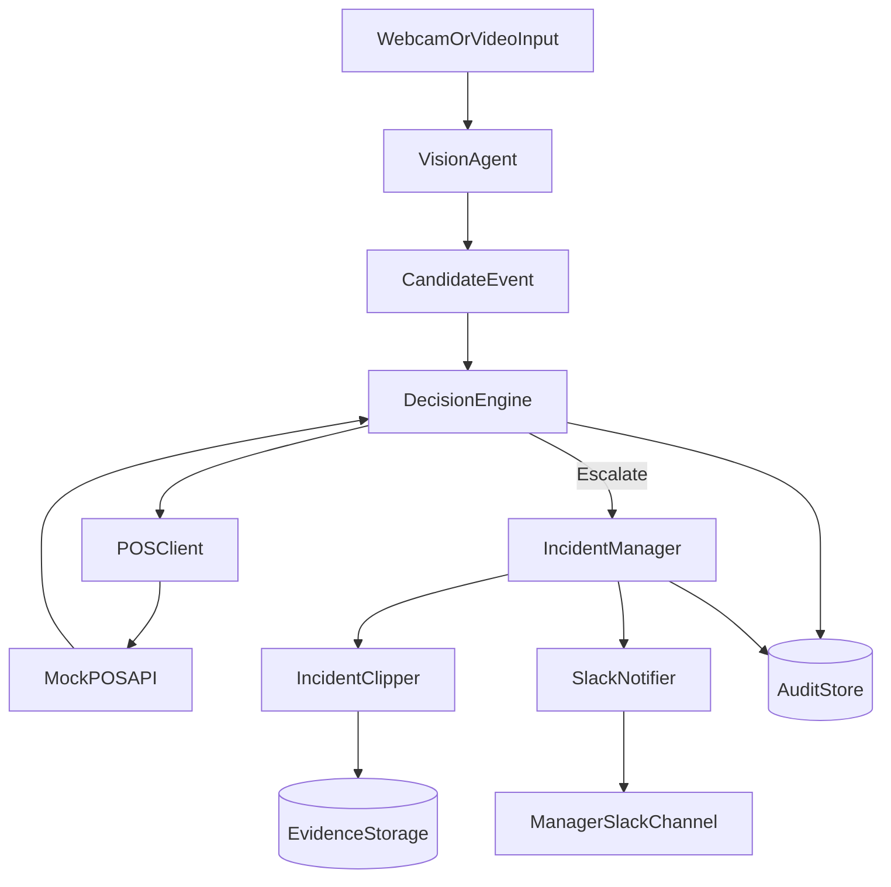

# Architecture

## Mission

Detect potential retail shrinkage with low-noise alerts by combining visual behavior understanding with transactional truth from POS systems.

## Service boundaries

- `VisionAgent`: Processes stream and emits suspicious behavior candidate events.
- `POSClient`: Fetches recent scan activity for SKU/time-window verification.
- `DecisionEngine`: Applies escalation rules and confidence thresholds.
- `IncidentManager`: Owns incident state transitions and evidence metadata.
- `IncidentClipper`: Exports a 5-second mp4 around incident timestamps.
- `SlackNotifier`: Sends actionable alert cards to store operations channels.

## Data-flow diagram

## Incident lifecycle

1. `observed`: suspicious candidate created by vision pipeline.
2. `validated`: POS cross-check completed.
3. `escalated`: mismatch found and confidence threshold met.
4. `packaged`: clip + payload attached.
5. `notified`: Slack alert delivered successfully.
6. `closed`: incident acknowledged or auto-resolved.

## Non-functional targets

- p95 decision latency: under 2 seconds (excluding clip export)
- alert precision focus: prioritize fewer, high-quality alerts
- deterministic incident IDs for auditability and replay
- idempotent webhook publishing for retry safety
